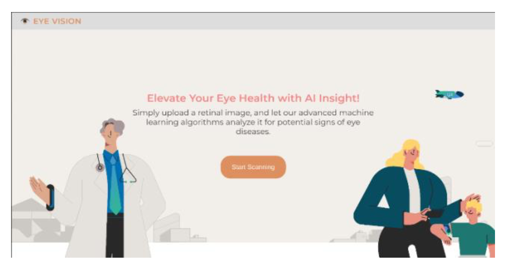
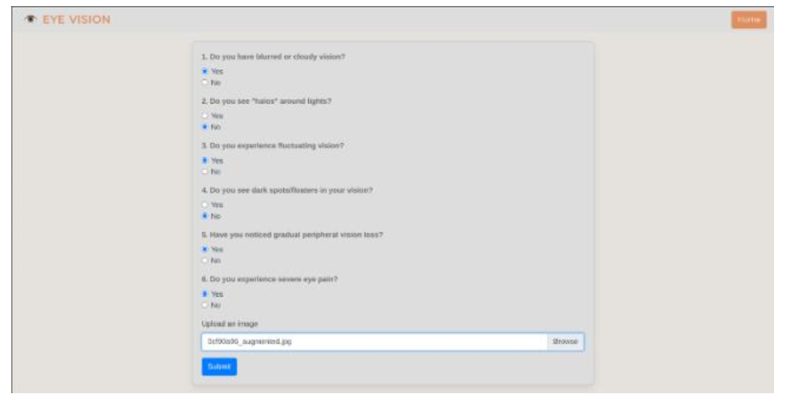
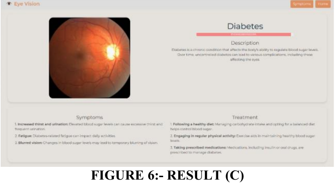
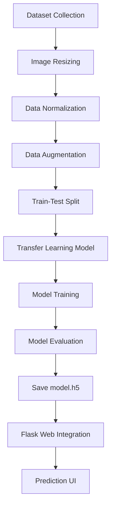
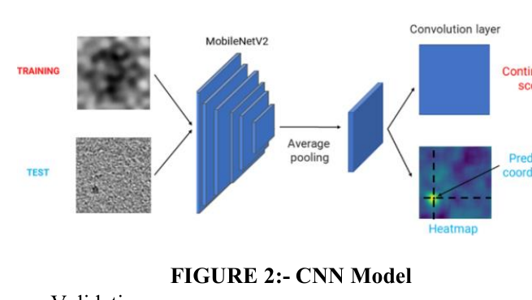
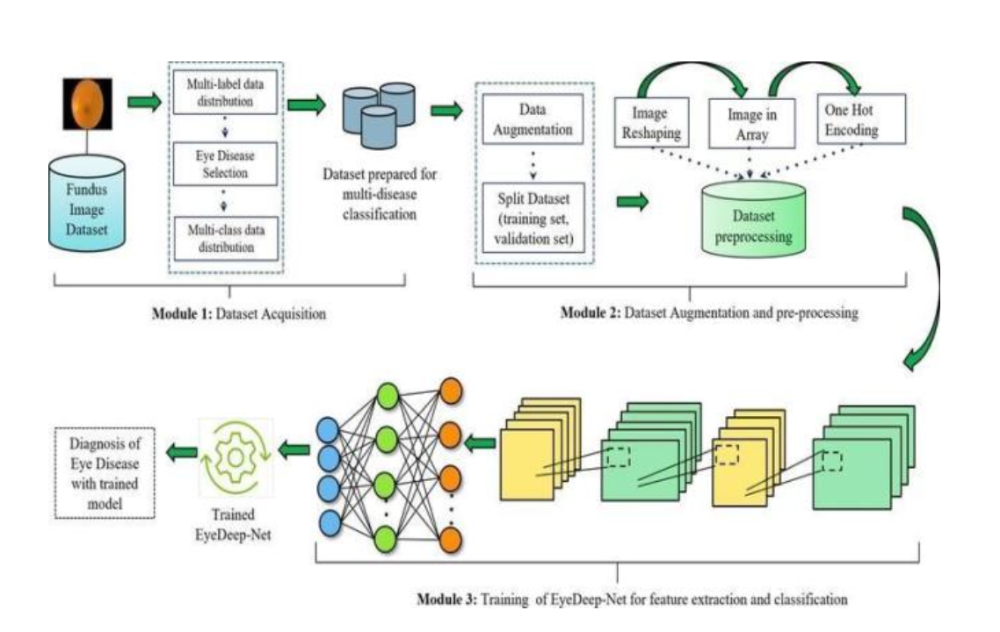
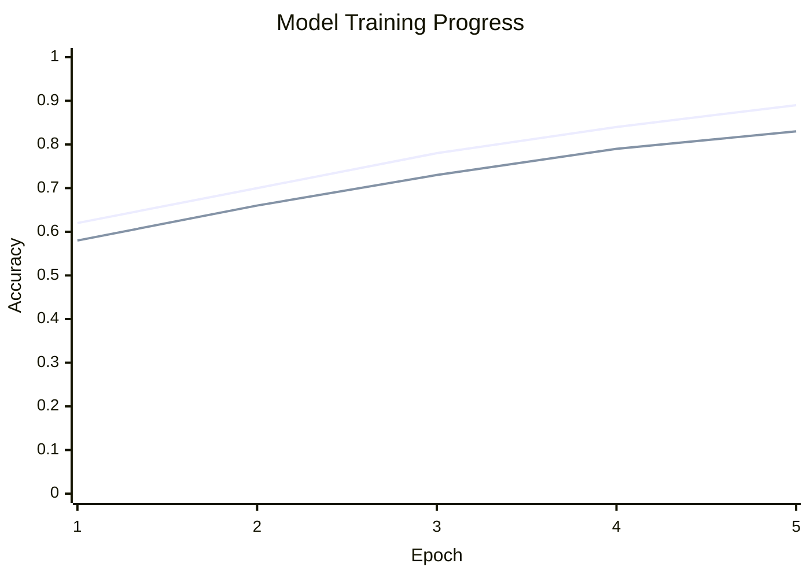

# Multiple Eye Disease Detection Using Machine Learning


A web-based deep learning project that detects multiple eye disease categories from uploaded eye images. The application uses a trained image classification model and a Flask interface to help users upload an image, answer symptom-related questions, and view a predicted disease class with supporting information.

> **Medical disclaimer:** This project is intended for educational and research purposes only. It is not a replacement for professional diagnosis, screening, or treatment by a qualified ophthalmologist.

---

## Table of Contents

- [Problem Statement](#problem-statement)
- [Project Overview](#project-overview)
- [Demo Screenshots](#demo-screenshots)
- [Key Features](#key-features)
- [Disease Classes](#disease-classes)
- [Methodology](#methodology)
- [Model Architecture](#model-architecture)
- [Tools and Technologies](#tools-and-technologies)
- [Project Structure](#project-structure)
- [Installation and Setup](#installation-and-setup)
- [How to Run](#how-to-run)
- [Expected Outcomes](#expected-outcomes)
- [Evaluation Metrics](#evaluation-metrics)
- [Limitations](#limitations)
- [Future Scope](#future-scope)
- [Contributors](#contributors)

---

## Problem Statement

Eye diseases such as cataract, diabetic retinopathy, glaucoma, and other retinal abnormalities can lead to severe vision loss when they are not detected early. Traditional screening depends heavily on manual examination by trained specialists, which can be time-consuming and less accessible in areas with limited ophthalmic resources.

This project addresses that problem by building a machine-learning-assisted web application that can analyze an uploaded eye image and predict the most likely disease class. The goal is to support early awareness, faster screening workflows, and more accessible preliminary eye-health assessment.

---

## Project Overview

The system accepts an eye image through a Flask-based web interface. The uploaded image is resized, normalized, and passed to a trained deep learning model. The model predicts one of the supported classes and returns the result along with a short disease description and user symptom inputs.

### High-Level Workflow


---

## Demo Screenshots

### Home Page

The landing page introduces the eye-health screening application and provides a call-to-action for starting the screening process.



### Symptom and Image Upload Form

The user can answer symptom-related questions and upload an eye image for prediction.



### Prediction Result Page

The result page displays the predicted disease category, a short description, symptoms, and treatment-related guidance.



---

## Key Features

- Upload eye images through a simple web interface.
- Predict multiple eye disease categories using a trained deep learning model.
- Uses image preprocessing before prediction.
- Displays prediction output with disease-specific explanation.
- Collects symptom inputs to make the interface more informative.
- Lightweight Flask application suitable for local deployment and demonstration.
- Designed for educational, research, and academic project presentation use.

---

## Disease Classes

The current application supports the following prediction classes:

| Class | Description |
|---|---|
| Cataract | Clouding of the eye lens that may cause blurred or foggy vision. |
| Diabetic Retinopathy | Diabetes-related retinal damage caused by changes in blood vessels. |
| Glaucoma | A group of eye conditions that damage the optic nerve and may cause vision loss. |
| Normal | Indicates that no supported disease signs were detected by the model. |
| Other | Represents eye conditions outside the main trained categories. |

---

## Methodology

The project follows a standard machine learning pipeline for medical image classification.



### 1. Data Collection

Eye image datasets are collected and organized into class-specific folders. The project report discusses public datasets used in ophthalmic research, such as datasets for retinal images, diabetic retinopathy, cataract, glaucoma, eye infections, and dry-eye-related conditions.

### 2. Data Preprocessing

Before training and prediction, images are converted into a consistent format:

- Resize input images to `256 x 256` pixels.
- Convert images into numerical arrays.
- Normalize pixel values by scaling them between `0` and `1`.
- Apply augmentation during training to improve generalization.

### 3. Model Training

The model training script uses transfer learning with **MobileNetV2** as the base model. The base model extracts image features, followed by additional dense layers for multi-class classification.

### 4. Prediction

During prediction, the uploaded image is preprocessed in the same format used during training. The model outputs probabilities for each class, and the class with the highest probability is selected as the final prediction.

---

## Model Architecture

The project uses a CNN-based image classification approach with transfer learning.



### Architecture Used

```text
Input Image: 256 x 256 x 3
        |
MobileNetV2 Base Model
        |
Global Average Pooling
        |
Dense Layer: 256 neurons, ReLU
        |
Dropout: 0.5
        |
Output Layer: 5 neurons, Softmax
```

The softmax output layer produces probabilities for the five supported disease classes.

### System Architecture



---

## Tools and Technologies

| Category | Tools / Libraries |
|---|---|
| Programming Language | Python |
| Web Framework | Flask |
| Deep Learning | TensorFlow, Keras |
| Model Architecture | MobileNetV2, CNN, Transfer Learning |
| Image Processing | PIL, Keras Image Preprocessing, OpenCV if used locally |
| Frontend | HTML, CSS |
| Model File | `model.h5` |
| Deployment Type | Local Flask server |

---

## Project Structure

```text
Multiple-eye-disease-detection-using-machine-learning/
|
|-- app.py                  # Main Flask application
|-- build_model.py          # Model training script using MobileNetV2
|-- augument.py             # Data augmentation script
|-- resize.py               # Image resizing / preprocessing script
|-- split_test.py           # Dataset splitting script
|-- README.md               # Project documentation
|
|-- templates/              # HTML templates
|   |-- home.html
|   |-- symptoms.html
|   |-- diagnosis.html
|   |-- faq.html
|
|-- static/                 # Static files and uploaded image output
|
|-- assets/
|   |-- images/             # README screenshots and diagrams
```

---

## Installation and Setup

### 1. Clone the Repository

```bash
git clone https://github.com/22f2000834/Multiple-eye-disease-detection-using-machine-learning.git
cd Multiple-eye-disease-detection-using-machine-learning
```

### 2. Create a Virtual Environment

#### Windows

```bash
python -m venv venv
venv\Scripts\activate
```

#### macOS / Linux

```bash
python3 -m venv venv
source venv/bin/activate
```

### 3. Install Dependencies

If a `requirements.txt` file is available:

```bash
pip install -r requirements.txt
```

Otherwise, install the main dependencies manually:

```bash
pip install flask tensorflow pillow numpy opencv-python
```

### 4. Add the Trained Model

Place your trained model file in the project directory:

```text
model.h5
```

Then update the `model_path` inside `app.py` if required:

```python
model_path = "model.h5"
```

> The current code may contain an absolute local path. For portability on GitHub, use a relative path such as `model.h5`.

---

## How to Run

Start the Flask application:

```bash
python app.py
```

Open the app in your browser:

```text
http://127.0.0.1:5000/
```

---

## Expected Outcomes

The project produces a working prototype that:

- Accepts an eye image from the user.
- Preprocesses the image into the format required by the model.
- Predicts one of the supported disease categories.
- Displays the predicted class and probability.
- Provides a disease description and symptom-related information.
- Demonstrates how deep learning can support preliminary eye-disease screening.

---

## Evaluation Metrics

Use the following table to document model performance after training and testing. Replace the placeholder values with your actual results.

| Metric | Value |
|---|---:|
| Training Accuracy | Add value |
| Validation Accuracy | Add value |
| Test Accuracy | Add value |
| Precision | Add value |
| Recall | Add value |
| F1-Score | Add value |

Recommended evaluation visuals to add later:

- Accuracy vs. epochs graph.
- Loss vs. epochs graph.
- Confusion matrix.
- Class-wise precision, recall, and F1-score chart.

Example training visualization format:



> Replace this example chart with actual training history values before final submission.

---

## Limitations

- The model should not be used as a clinical decision system.
- Prediction quality depends on dataset size, image quality, class balance, and training methodology.
- The current model supports only the trained disease categories.
- A larger clinically validated dataset is required for real-world medical reliability.
- The project currently runs as a local Flask prototype.

---

## Future Scope

- Add a verified performance report with accuracy, precision, recall, F1-score, and confusion matrix.
- Improve dataset quality and class balance.
- Add Grad-CAM or heatmap visualization to explain model predictions.
- Deploy the application on Render, Railway, AWS, Azure, or Google Cloud.
- Add user authentication and screening history.
- Support more eye disease classes.
- Add multilingual patient-friendly result explanations.
- Integrate a doctor/admin dashboard for reviewing uploaded cases.

---

## Contributors

- Gaurav Pawar
- Manas Rajput
- Mohammad Dalwai
- Avinash Kumar
- Nusrat Parveen
- Gayatri Hegde

---

## Acknowledgement

This project is inspired by the use of machine learning and deep learning in ophthalmic image analysis for early detection of eye diseases. It demonstrates how AI-based image classification can be integrated with a web interface to create an accessible screening prototype.
